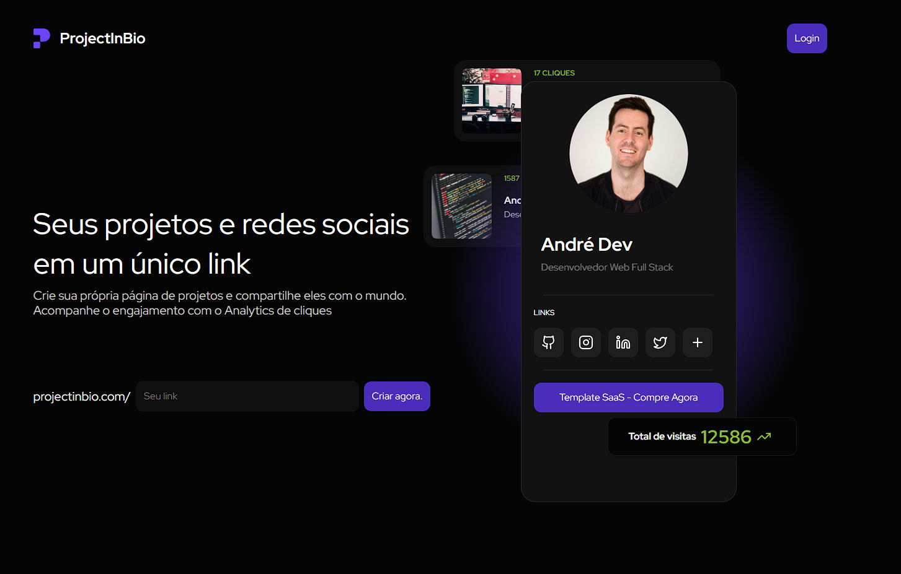

<br>

# **Project in Bio** 🚀

**Project in Bio** é uma plataforma inovadora que permite criar uma página personalizada para exibir seus projetos e redes sociais em um único link. Ideal para desenvolvedores e profissionais que querem compartilhar seu trabalho de forma simples e eficaz.

Além disso, com o **analytics de visitas**, você pode acompanhar o engajamento com seus projetos e medir o impacto da sua presença online.

---

## 📋 **Recursos Principais**

- **Criação de Página de Projetos**: Exiba seus projetos, redes sociais e outros links em um único lugar.
- **Analytics de Visitas**: Monitore o número de cliques e interações nos seus projetos.
- **Fácil Criação de Projetos**: Adicione projetos com título, descrição, imagem e URL.
- **Modo Trial e Upgrade**: Oferece opções de upgrade para acessar mais recursos e manter a página ativa.

---

## ⚙️ **Tecnologias Usadas**

- **Frontend**:
  - **Next.js**: Framework React para renderização do lado do servidor.
  - **Tailwind CSS**: Estilização responsiva e rápida.
  - **React**: Biblioteca para interfaces interativas.

- **Backend**:
  - **Node.js** com **Express**: Gerenciamento do servidor e API.
  - **Prisma**: ORM para interação com bancos de dados SQL.

- **Autenticação e Armazenamento**:
  - **Firebase**: Para autenticação de usuários e armazenamento de imagens.
  - **Auth js**: Para autenticação de usuários.

- **Outros**:
  - **Mixpanel**: Monitoramento de eventos no servidor.
  - **Lucide Icons**: Ícones no estilo moderno.
  - **Stripe**: Integração de pagamento.
  - **Resend**: Serviço de e-mail para notificações.

---

## 🔧 **Como Rodar o Projeto**

1. **Clone o repositório:**

   ```bash
   git clone https://github.com/caiosantosxp/project-in-bio.git
   cd project-in-bio
   ```

2. **Instale as dependências:**

   ```bash
   npm install
   ```

3. **Crie o arquivo `.env` com as variáveis de ambiente do Firebase:**

   ```bash
    FIREBASE_PROJECT_ID=
    FIREBASE_CLIENT_EMAIL=
    FIREBASE_PRIVATE_KEY=
    FIREBASE_STORE_BUCKET=

    AUTH_GOOGLE_ID=
    AUTH_GOOGLE_SECRET=
    AUTH_SECRET=

    STRIPE_PRICE_ID=
    STRIPE_SUBSCRIPTION_PRICE_ID=
    STRIPE_SECRET_KEY=
    STRIPE_WEBHOOK_SECRET=
    NEXT_PUBLIC_STRIPE_PUBLISHABLE_KEY=

    RESEND_API_KEY=
   ```

4. **Execute o projeto:**

   ```bash
   npm run dev
   ```

Agora o seu projeto estará disponível em `http://localhost:3000`.
